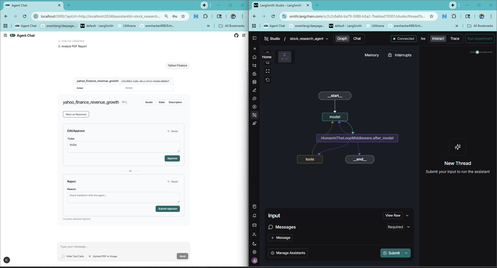
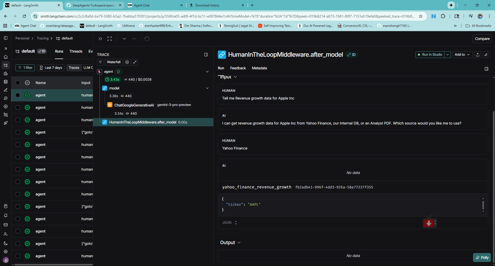

# DeepAgents Turbopack

A collection of LangGraph-based Deep Agents demonstrating various design patterns and architectures for building production-ready AI agents. This project showcases different agent patterns including Human-in-the-Loop (HIL), PII protection, and task management middleware.

## Overview

This repository contains multiple Deep Agent implementations that demonstrate real-world patterns and best practices for building AI agents using LangGraph and LangChain. Each agent showcases different middleware patterns, tool configurations, and architectural approaches.

## Agents

### 1. Stock Research Agent (Human-in-the-Loop)

A stock research agent focused on revenue growth analysis that demonstrates Human-in-the-Loop patterns for tool approval workflows.

**Location:** `agents/stock_research_agent/`

#### Features

- **Human-in-the-Loop Middleware**: All tool executions require explicit human approval
- **Multiple Data Sources**: Yahoo Finance, Internal Database, Analyst PDF Reports
- **Interactive Tool Approval**: Users can approve, edit parameters, or reject tool calls
- **Full Observability**: Integrated with LangSmith for tracing and debugging

#### Architecture

The agent uses LangGraph's `HumanInTheLoopMiddleware` to interrupt execution before any tool is called, allowing users to:
- **Approve** the tool call with current parameters
- **Edit** the parameters before execution
- **Reject** the tool call with feedback

#### Screenshots

**Agent Chat Interface**



The chat interface shows the agent asking which data source to use and the tool approval panel where users can approve or reject the `yahoo_finance_revenue_growth` tool call.

**LangSmith Observability**



Full trace visibility in LangSmith showing the agent execution flow, including the `HumanInTheLoopMiddleware.after_model` step where the agent pauses for human approval.

#### Tools

| Tool | Description |
|------|-------------|
| `yahoo_finance_revenue_growth` | Fetch revenue growth from Yahoo Finance |
| `internal_db_revenue_growth` | Fetch revenue growth from internal database |
| `analyst_pdf_revenue_growth` | Summarize revenue growth from analyst PDF reports |

---

### 2. Resume Analyst Agent

A professional resume analysis agent that evaluates and improves resumes across diverse industries with built-in PII protection and task management.

**Location:** `agents/resume_analyst_agent/`

#### Features

- **PII Protection Middleware**: Automatically redacts/masks sensitive information (emails, credit cards, URLs)
- **TodoList Middleware**: Structured task management for multi-step analysis workflows
- **Document Processing**: Uses Docling for parsing multiple document formats (PDF, DOCX)
- **Comprehensive Analysis**: Skills matching, experience calculation, improvement suggestions
- **Industry-Tailored Feedback**: Adapts recommendations based on professional context

#### Architecture

The agent combines multiple middleware patterns:
- `PIIMiddleware`: Protects sensitive data with configurable redaction/masking strategies
- `TodoListMiddleware`: Manages complex multi-step analysis tasks

#### Screenshots

**Resume Analyst Chat & Observability**


The interface showing resume analysis in action with full LangSmith observability.

**Agent Code Structure**


#### Tools

| Tool | Description |
|------|-------------|
| `read_resume` | Read and parse resume files using Docling (PDF, DOCX, etc.) |
| `extract_information` | Extract structured data: name, contact, experience, skills, education |
| `generate_summary` | Create comprehensive analysis reports with insights |
| `calculate_experience_years` | Calculate total years of experience from resume data |
| `match_job_requirements` | Compare resume skills against job requirements with match scoring |
| `suggest_improvements` | Provide actionable suggestions to enhance the resume |

---

## Getting Started

### Prerequisites

- Python 3.11+
- LangGraph CLI
- Google Gemini API key (or configure alternative LLM)

### Installation

1. Clone the repository:
   ```bash
   git clone <repository-url>
   cd DeepAgents-Turbopack
   ```

2. Install dependencies:
   ```bash
   pip install -r requirements.txt
   ```

3. Configure environment variables:
   ```bash
   cp .env.example .env
   # Add your API keys
   ```

### Running the Agents

Start the LangGraph development server:
```bash
langgraph dev
```

Open the Agent Chat interface at `http://localhost:3000`

## Tech Stack

- **LangGraph**: Agent orchestration with state management
- **LangChain**: Tool definitions and LLM integration
- **Google Gemini**: LLM (gemini-3-pro-preview)
- **LangSmith**: Observability and tracing
- **Docling**: Document conversion and parsing

## Project Structure

```
├── agents/
│   ├── stock_research_agent/
│   │   └── stock_research_agent_hil.py    # HIL pattern agent
│   └── resume_analyst_agent/
│       └── resume_analyst_agent.py        # PII + TodoList middleware agent
├── screenshots/
│   ├── AgentWithHIL.png
│   ├── AgentWithHIL-Langsmith.png
│   ├── Resume-Analyst-Chat-Observability.png
│   └── Resume-Analyst-Agent-Code.png
├── langgraph.json
└── requirements.txt
```

## Future Agents

This project will continue to grow with more Deep Agent implementations demonstrating additional patterns:
- Multi-agent collaboration patterns
- RAG-enhanced agents
- Streaming and real-time agents
- Custom checkpointing strategies
- And more...

## License

MIT

